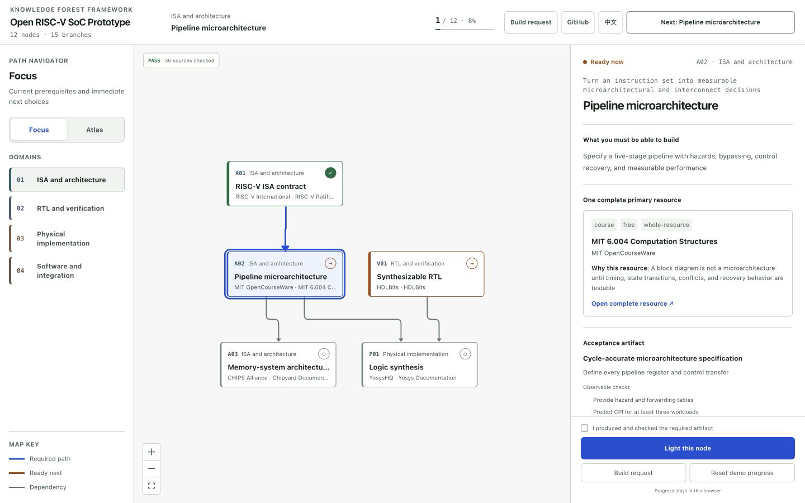
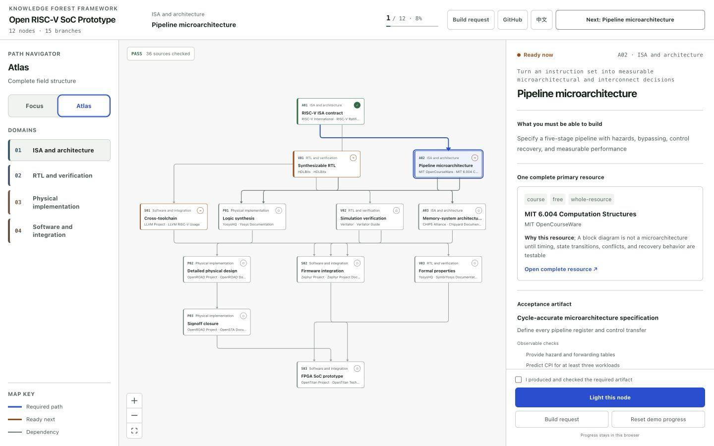
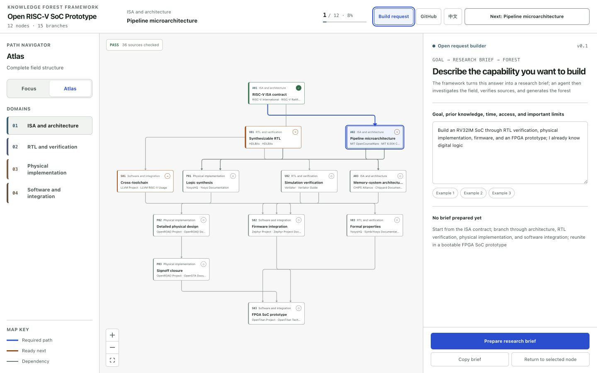
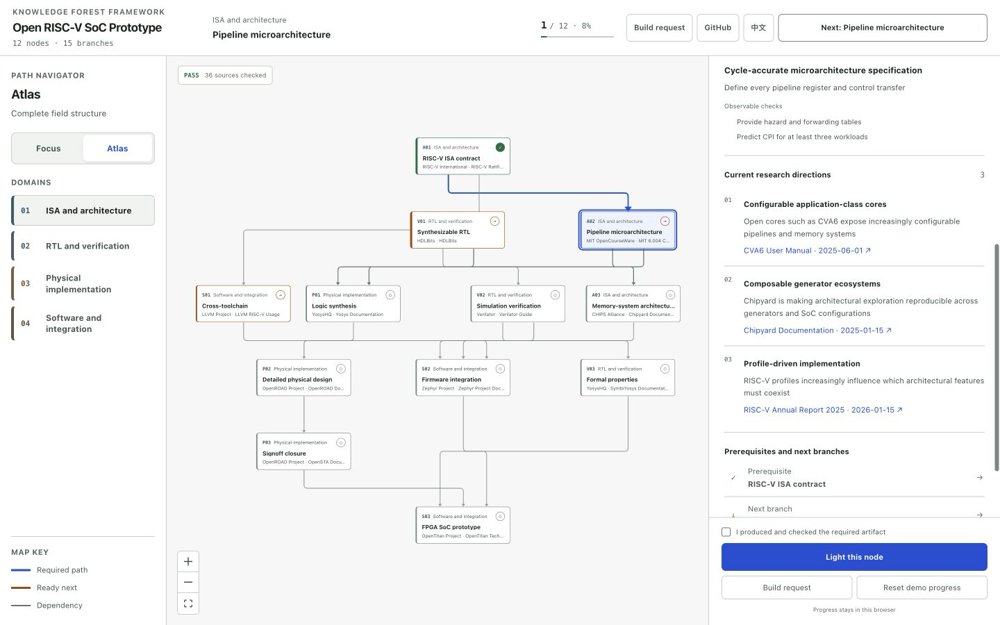
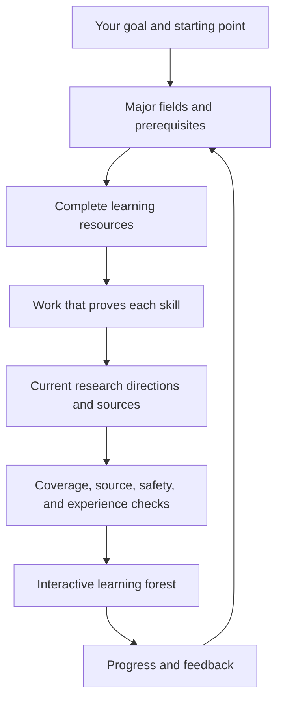

<div align="center">


Figure 1 Project visual overview

# Knowledge Forest Framework

**Describe what you want to learn; get a clear path you can follow, finish, and maintain**

[](https://github.com/AIALRA-0/knowledge-forest-framework/actions/workflows/ci.yml)
[](package.json)
[](package.json)
[](LICENSE)
[](docs/privacy.md)
[](docs/privacy.md)
[](#25-mobile-readable-path)

[简体中文](README.md) · [Demo entry](#6-try-it) · [How it works](docs/architecture.md) · [Quality checks](docs/quality-gates.md) · [Security](SECURITY.md)

</div>

> [!IMPORTANT]
> This README does not publish the production product address, access controls, private repositories, personal progress, accounts, credentials, host details, or deployment configuration. Open the public demo from the Website field beside the repository description.

## 1 Project position

Knowledge Forest turns a broad ambition into separate learning paths. Every step tells you what to learn from, what to make before moving on, what must be completed first, and where current research is heading [1].

## 2 Product interface

The public release and the private production product now use one visual and interaction model; the default Focus view keeps the required path and immediate next choices readable; Atlas shows the field structure without turning daily learning into a wall of nodes

Blue lines mark the exact prerequisite path into the selected node; brown lines mark an immediately learnable next step; gray lines preserve surrounding dependency context

The English screens below come directly from the working public release; the Chinese README also includes public-safe crops from current production fields; neither gallery exposes personal progress, a private address, access-control configuration, deployment detail, or private aggregate

### 2.1 Focused learning path

The selected pipeline node keeps its complete prerequisite path, nearby branches, one complete primary resource, an acceptance artifact, and current research evidence in one working screen

<p align="center">
  
  <br>Figure 2.1 Selected node, prerequisite path, resource, and acceptance work [2]
</p>

### 2.2 Complete field atlas

Atlas reveals every branch and merge in the public example; Focus remains one click away when the learner is ready to continue

<p align="center">
  
  <br>Figure 2.2 Branched and converging field atlas [2]
</p>

### 2.3 Request builder

The request builder turns an ordinary description of the goal, prior knowledge, time, access, and constraints into a structured brief an agent can investigate

<p align="center">
  
  <br>Figure 2.3 Structured request builder [2]
</p>

### 2.4 Research evidence

Every node carries three current directions; each direction explains the open problem and links it to dated evidence

<p align="center">
  
  <br>Figure 2.4 Dated research directions for a selected node [2]
</p>

### 2.5 Mobile-readable path

On mobile, the two-dimensional canvas becomes a dependency-indented list while node explanations, research evidence, and acceptance work remain available.

The Chinese gallery includes a public-safe mobile capture, while the English page preserves the same responsive dependency-list behavior without mixing localized screenshots [2].

## 3 Usage flow

- First, write the goal in your own words, including what you already know, how much time you have, and any limits that matter

- Second, give the generated request to an agent using the included workflow

- Third, open the resulting forest and choose a field

- Fourth, learn from the complete resource, produce the listed work, mark the step complete, and move to the next unlocked step

- Fifth, return later and continue from the progress saved in your browser

## 4 Node contents

- one focused skill or idea
- a short explanation of why it matters
- one complete course, book, article, standard, or official documentation set
- a concrete result to produce before the step counts as complete
- prerequisite steps and a clear explanation when the step is locked
- three current research directions with dated sources
- progress, feedback, export, and a way to report an unavailable resource

## 5 Public example

The public example is a complete RISC-V SoC engineering tree, not a single chain. ISA and synthesizable RTL foundations split into architecture, RTL verification, physical implementation, and software integration, then reunite in a bootable FPGA SoC prototype. It contains 12 nodes, each with one complete resource and one engineering artifact, for 12 resources and 12 artifacts [3]. Each node has three current research directions, so $12 \times 3 = 36$ directions [3].

English and Chinese have separate entry URLs and fully localized interfaces; both render the same dependency graph and preserve the same browser-local progress without mixing languages on one page

The following figure and table read the generated public-example data directly [3].

<div align="center">


Figure 5.1 Statistics generated from the public ForestBundle

</div>

<div align="center">

Table 5.1 Public example scale

| Metric | Count | Purpose |
| --- | ---: | --- |
| Domains | 4 | Major branches in the public example |
| Nodes | 12 | Learnable and assessable steps |
| Complete resources | 12 | One primary learning resource per node |
| Research directions | 36 | Three dated frontier positions per node |
| Quality rounds | 3 | Structure, evidence, and realistic experience |

Note: 12 nodes × 3 research directions per node = 36 research directions.

</div>

## 6 Try it

Open the public demo from the Website field beside the repository description. English and Chinese use separate localized entries. Enter a goal such as:

> I want to build an RV32IM SoC through RTL verification, physical implementation, firmware, and an FPGA prototype; I already know digital logic

The page prepares a structured request; an agent then researches the field, checks the sources, and generates the complete forest

## 7 Run it locally

```bash
git clone https://github.com/AIALRA-0/knowledge-forest-framework.git # Clone the public framework
cd knowledge-forest-framework # Enter the project directory
npm install # Install dependencies from the lockfile
npm run dev # Start the local development interface
```

The project requires Node.js 22.13 or later [4].

Prepare a request from the command line:

```bash
node packages/cli/bin/knowledge-forest.mjs brief "Build a research-level learning forest for embodied AI; I already know Python" # Convert a learning goal into a structured brief
```

Check a generated forest:

```bash
node packages/cli/bin/knowledge-forest.mjs audit examples/public-demo/forest.generated.json # Validate a generated forest
```

Give [`skills/knowledge-forest/SKILL.md`](skills/knowledge-forest/SKILL.md) to a compatible agent for the complete research and generation workflow

## 8 Forest generation

<div align="center">



Figure 8.1 Research, generation, audit, and learning loop

</div>

Every production run creates:

```text
# Generated artifacts
forest.generated.json  # Forest rendered by the interface
provenance.json        # Information-source record
audit-report.json      # Automated check results
review-queue.json      # Decisions that still need a person
```

In plain language; these files contain the forest shown on the page, where its information came from, which checks passed, and which decisions still need a person

## 9 Quality gates

`npm test` runs structure, evidence, experience, sanitization, and build checks [5].

- every step belongs to a clear field and has valid prerequisites
- links point to complete resources rather than isolated chapters
- completion requires a visible piece of work
- current research directions have dates and sources
- health, finance, aviation, space, and security requests receive appropriate boundaries
- private paths, accounts, credentials, and personal course records cannot enter the public build
- the production page builds successfully

Automated checks are not enough; releases also include realistic desktop and mobile use; reviewers record where a person became confused, whether recovery was obvious, and what changed afterward

Read the latest [real user journey review](docs/user-journey-review.md)

## 10 Public-private boundary

Use this public repository for reusable code, empty templates, synthetic examples, and common improvements

Keep personal progress, private learning data, restricted resources, research archives, credentials, authentication, and deployment configuration in a separate private repository; the framework does not copy private data into the public project

## 11 Maintainer guide

<div align="center">

Table 11.1 Maintainer directory guide

| Path | Contents |
| --- | --- |
| `app/` | Interactive public demo |
| `packages/schema/` | Data shapes shared by generators and renderers |
| `packages/core/` | Prerequisite, progress, and quality rules |
| `packages/agent/` | Plain-language request preparation |
| `packages/cli/` | Local generation and validation commands |
| `skills/knowledge-forest/` | End-to-end agent workflow |
| `prompts/` | Focused research instructions |
| `schemas/` | Machine-readable file definitions |
| `templates/` | Empty learner inputs |
| `examples/public-demo/` | Independently public example |
| `docs/` | Design, quality, privacy, and policy |
| `scripts/` | Reports, statistics, sanitization, and journey checks |
| `tests/` | Repeatable release checks |

</div>

The [project landscape](docs/project-landscape.md) compares related curriculum, roadmap, graph, and research-index projects; the [architecture](docs/architecture.md) explains the internal file flow; the [agent protocol](docs/agent-protocol.md) defines the generation process

## 12 Privacy boundary

- progress and feedback stay in the browser by default [6]
- the public demo includes no telemetry
- public examples are independently generated
- third-party material remains link-only unless redistribution permission is explicit [7]
- original code uses Apache-2.0
- public example learning content uses CC BY 4.0
- generated forests keep the license selected by their owner

Read [privacy](docs/privacy.md), [content policy](docs/content-policy.md), and [security](SECURITY.md) before publishing an instance [8].

## 13 Contributing

Start with [CONTRIBUTING.md](CONTRIBUTING.md); explain the user problem, show the resulting behavior, and include the checks and real journey used to evaluate the change

## 14 Roadmap

- `0.2` connect more research sources and preserve link snapshots [9]
- `0.3` add extension interfaces and richer connections between fields [9]
- `1.0` guarantee long-term file compatibility and signed releases [9]

## 15 Status

This is an early public release; use the review queue when a source, license, safety boundary, or field-coverage decision still needs a person; a generated forest is a learning guide and does not replace professional medical, legal, financial, licensing, or regulatory advice

## 16 References

[1] AIALRA-0, “Architecture,” `docs/architecture.md`, Knowledge Forest Framework repository.

[2] AIALRA-0, “Public-safe product gallery,” `docs/images/gallery.json`, Knowledge Forest Framework repository.

[3] AIALRA-0, “Generated public demo and statistics,” `examples/public-demo/forest.generated.json` and `public/readme-stats.svg`, Knowledge Forest Framework repository.

[4] AIALRA-0, “Runtime and release scripts,” `package.json`, Knowledge Forest Framework repository.

[5] AIALRA-0, “Quality gates,” `docs/quality-gates.md`, Knowledge Forest Framework repository.

[6] AIALRA-0, “Privacy boundary,” `docs/privacy.md`, Knowledge Forest Framework repository.

[7] AIALRA-0, “Content policy and licensing,” `docs/content-policy.md`, `LICENSE`, and `LICENSE-CONTENT.md`, Knowledge Forest Framework repository.

[8] AIALRA-0, “Security policy,” `SECURITY.md`, Knowledge Forest Framework repository.

[9] AIALRA-0, “Published roadmap,” earlier English README release, Knowledge Forest Framework repository.
