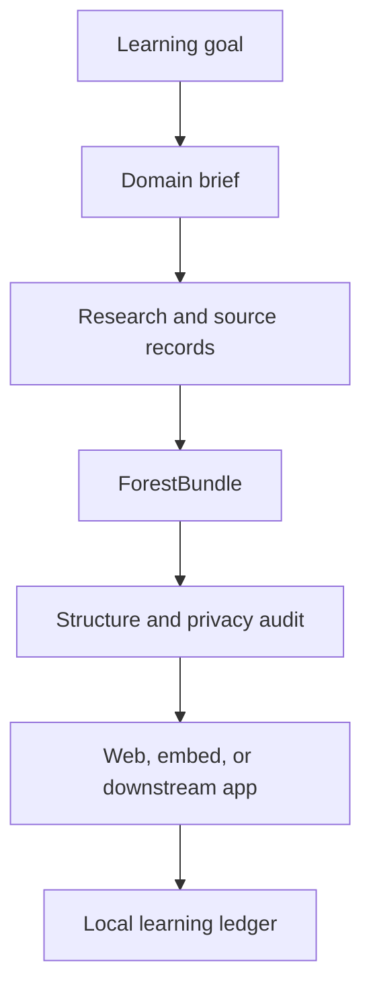

<div align="center">
  
  <p><em>Figure 1 Knowledge Forest Framework research, audit, and learning workflow</em></p>
  <h1>Knowledge Forest Framework</h1>
  <p><em>Turn one learning goal into a researchable, auditable, finishable, and maintainable knowledge forest</em></p>
</div>

<div align="center">
  <a href="README.md">中文</a> ·
  <a href="https://aialra-0.github.io/knowledge-forest-framework/">Live demo</a> ·
  <a href="docs/architecture.md">Architecture</a> ·
  <a href="docs/quality-gates.md">Quality gates</a> ·
  <a href="SECURITY.md">Security</a>
</div>

Knowledge Forest Framework turns domain definitions, research evidence, learning order, completion criteria, and personal progress into one verifiable data model and interface instead of a directory of disconnected links.

The public repository contains only framework code, synthetic examples, and sanitized evidence. Do not commit real accounts, learning records, internal addresses, production configuration, restricted materials, or content from private repositories.

## 1 What you can try now

The [live demo](https://aialra-0.github.io/knowledge-forest-framework/) is a fully synthetic RISC-V SoC learning forest with:

- 4 domains, 12 nodes, 12 resources, and 36 research frontiers
- Prerequisites, locked nodes, active learning, and completed states
- A light theme and a neutral pure-black night theme that preserve domain and progress colors
- A local learning ledger with completion, state distribution, domain progress, and a 14-day activity trend
- Chinese and English interfaces, domain briefs, and structured audit reports
- Demo progress stored only in the current browser, with no telemetry upload

<div align="center">
  
  <p><em>Figure 2 Public demo scale, deterministically generated from synthetic repository data</em></p>
</div>

## 2 What the framework solves

Knowledge Forest Framework divides a broad goal into independently learnable and maintainable nodes. Each node can retain:

- A clear scope, boundary, and prerequisite chain
- Traceable sources and selection rationale
- Research frontiers, practical outputs, and completion criteria
- Publication, review, and personal learning states
- Reproducible content bundles, audit reports, and public demos

A “node” is the smallest learning unit. A “frontier” is a question that remains worth investigating. A “content bundle” is the structured `ForestBundle` consumed by the renderer or another application.

## 3 Quick start

Requirement: Node.js 22.13 or newer.

```bash
# Clone the repository and start the local development server
git clone https://github.com/AIALRA-0/knowledge-forest-framework.git
cd knowledge-forest-framework
npm ci
npm run dev
```

Generate and audit the synthetic demo:

```bash
# Regenerate the synthetic demo and run the complete validation suite
npm run demo:build
npm run audit:content
npm test
```

Create a domain brief from a natural-language goal:

```bash
# Create a brief from the goal, then audit the generated bundle
npx knowledge-forest brief "Build a RISC-V SoC learning path"
npx knowledge-forest audit examples/public-demo/forest.generated.json
```

## 4 From input to a learnable interface

<div align="center">



<p><em>Figure 3 The same structured content connects research, review, publication, and learning</em></p>
</div>

## 5 Data and security boundaries

- Example data must be synthetic, openly licensed, or used with permission
- Browser progress and activity statistics stay local by default and can be cleared at any time
- The framework does not require a production domain, authentication service, cookie, token, or database credential
- Run `npm run audit:sanitize` before publication to detect common credentials, private keys, local paths, and internal addresses
- Report security issues privately through [SECURITY.md](SECURITY.md); do not disclose secrets in a public issue

See [Privacy](docs/privacy.md) and [Quality gates](docs/quality-gates.md) for details.

## 6 Validation

```bash
# Run static checks, tests, and both builds
npm run lint
npm run typecheck
npm test
npm run build
npm run build:pages
```

Tests cover content generation, data contracts, learning states, themes, ledger statistics, rendered HTML, the public demo build, and sanitization. Generated reports use the bundle timestamp so identical input produces stable output.

## 7 Maintainer routes

- [Architecture](docs/architecture.md): responsibilities of the data, research, and rendering layers
- [Quality gates](docs/quality-gates.md): checks required before commits, builds, and releases
- [Contributing](CONTRIBUTING.md): conventions for data, code, and documentation changes
- [Changelog](CHANGELOG.md): formal releases and unreleased updates on `main`
- [Knowledge Forest skill](skills/knowledge-forest/SKILL.md): the standard workflow from a goal to an audited bundle

The latest formal release is `v0.1.0`. The `main` branch contains the newest framework improvements planned for the next release.

## 8 License and citation

Code is licensed under the [Apache License 2.0](LICENSE). Example content is licensed under [CC BY 4.0](LICENSE-CONTENT.md).

Citation metadata is available in [CITATION.cff](CITATION.cff).
