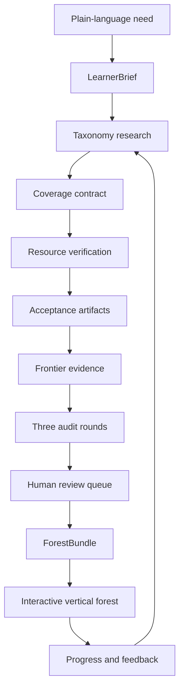

<div align="center">


# Knowledge Forest Framework

**Turn a learning ambition into an evidence-backed, auditable skill forest**

[](https://github.com/AIALRA-0/knowledge-forest-framework/actions/workflows/ci.yml)
[](LICENSE)
[](schemas/forest.schema.json)
[](docs/privacy.md)
[](docs/privacy.md)

[Live demo](https://aialra-0.github.io/knowledge-forest-framework/) · [中文说明](README.zh-CN.md) · [Agent protocol](docs/agent-protocol.md) · [Quality gates](docs/quality-gates.md) · [Security](SECURITY.md)

</div>

Knowledge Forest is an open framework for agents that investigate a field, build a prerequisite graph, select complete learning resources, define inspectable artifacts, attach current frontier evidence, and publish a vertical skill forest that can be maintained for years

It is deliberately not a one-shot course generator


## What makes the contract different

| Ordinary output | Knowledge Forest contract |
|---|---|
| A linear list of topics | Separate top-to-bottom domain trees with explicit prerequisites |
| Fragments and chapter assignments | One complete course, book, article, standard, or documentation set per node |
| “Read and understand” | An acceptance artifact with observable criteria |
| A timeless curriculum | Exactly three current, traceable frontier positions per node |
| A first-pass model answer | Taxonomy, evidence, and experience audit rounds |
| Feedback lost in chat history | Every accepted correction becomes a durable regression rule |
| A page that renders | Real novice, practitioner, cross-domain, high-risk, return-visit, and mobile journeys |

## Sixty-second start

```bash
git clone https://github.com/AIALRA-0/knowledge-forest-framework.git
cd knowledge-forest-framework
npm install
npm run dev
```

Create an agent-ready brief:

```bash
node packages/cli/bin/knowledge-forest.mjs brief \
  "Build a research-level learning forest for embodied AI; I already know Python"
```

Validate a generated bundle:

```bash
node packages/cli/bin/knowledge-forest.mjs audit \
  examples/public-demo/forest.generated.json
```

Ask your agent to follow [`skills/knowledge-forest/SKILL.md`](skills/knowledge-forest/SKILL.md) for the complete research and audit workflow

## The artifact pipeline



Every production generation creates:

```text
forest.generated.json
provenance.json
audit-report.json
review-queue.json
```

The renderer reads only a validated `forest.generated.json`

## The six corrections the framework remembers by default

1. Render top-to-bottom
2. Separate domains before creating nodes
3. Use complete resources instead of chapter fragments
4. Split compound topics into atomic nodes
5. Attach three current frontier positions to every node
6. Judge quality through realistic user journeys as well as deterministic tests

Projects can add learner-specific corrections; every correction needs a stable id and a regression check

## Public demonstration

The included example is a small, independently public forest for accessible public information dashboards:

- 3 separate domains
- 6 atomic nodes
- 6 complete primary resources
- 6 acceptance artifacts
- 18 frontier positions
- 3 audit rounds

The repository stores links and original summaries; it does not redistribute third-party course files

## Repository map

```text
app/                         interactive public demo
packages/schema/             provider-neutral types
packages/core/               graph, audit, and progress rules
packages/agent/              requirement normalization and correction memory
packages/cli/                local initialization and validation
skills/knowledge-forest/     agent-native end-to-end workflow
prompts/                     focused research and adversarial prompts
schemas/                     JSON Schema contracts
templates/                   empty learner inputs
examples/public-demo/        independently public example bundle
docs/                        architecture, protocol, quality, privacy, policy
scripts/                     reports, statistics, sanitization, experience cases
tests/                       deterministic contract tests
```

## Quality standard

```bash
npm test
```

The release gate checks:

- correction memory
- domain separation
- acyclic prerequisites
- whole-resource assignments
- acceptance criteria
- exact frontier counts
- rolling evidence freshness
- deterministic progress state
- high-risk intake detection
- sanitization
- production rendering

Scripted checks are only the first layer; each release also requires a written experience review based on realistic browser journeys

## Public and private instances

The recommended long-term architecture is:

```text
public framework release
          │
          │ exact pinned version
          ▼
private learner instance
```

Private knowledge, progress, restricted resources, research archives, credentials, authentication, and deployment configuration remain in the private instance; generic improvements are recreated with synthetic fixtures in the public framework; there is no automatic private-to-public sync

## Privacy and content rights

- progress and feedback are local-first
- no telemetry is included
- public examples are independently generated
- private hostnames, local paths, emails, credentials, and course records are rejected by the sanitization gate
- third-party resources are link-only unless redistribution permission is explicit
- code is licensed under Apache-2.0
- example learning content is licensed under CC BY 4.0
- generated user forests keep the license selected by their owner

Read [privacy](docs/privacy.md), [content policy](docs/content-policy.md), and [security](SECURITY.md) before publishing an instance

## Contributing

Start with [CONTRIBUTING.md](CONTRIBUTING.md); changes to schemas, correction rules, resource policy, audits, and release workflows require focused review and a migration note

## Roadmap

- `0.1` agent-native contract, CLI, schema, audits, public demo, local progress
- `0.2` research-provider adapters, link snapshots, migration tooling
- `0.3` plugin SDK, richer cross-tree bridges, scheduled re-audits
- `1.0` stable schema, signed releases, compatibility guarantees

## Status

The framework is an early public release; use the review queue for unresolved evidence or licensing decisions; do not represent an unreviewed generated forest as professional, medical, legal, financial, licensing, or regulatory advice
