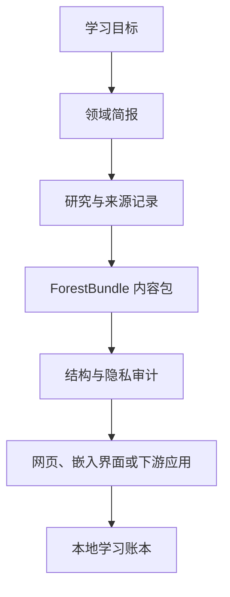

<div align="center">
  
  <p><em>图 1 Knowledge Forest Framework 的研究、审计与学习流程</em></p>
  <h1>Knowledge Forest Framework</h1>
  <p><em>把一个学习目标整理成可研究、可审计、可完成、可持续维护的知识森林</em></p>
</div>

<div align="center">
  <a href="README.en.md">English</a> ·
  <a href="https://aialra-0.github.io/knowledge-forest-framework/">在线演示</a> ·
  <a href="docs/architecture.md">架构</a> ·
  <a href="docs/quality-gates.md">质量检查</a> ·
  <a href="SECURITY.md">安全</a>
</div>

这是一个可复用的知识森林框架，它把领域定义、研究证据、学习顺序、完成标准和个人进度组织为同一套可验证的数据与界面，而不是把链接堆成目录

仓库公开内容只包含框架、合成示例和脱敏证据，请勿提交真实账号、学习记录、内部地址、生产配置、受限资料或私有仓库内容

## 1 现在可以体验什么

[在线演示](https://aialra-0.github.io/knowledge-forest-framework/) 使用完全合成的 RISC-V SoC 学习森林，包含：

- 4 个领域、12 个节点、12 项资源和 36 个研究前沿
- 节点依赖、未解锁状态、学习中与已完成状态
- 浅色主题和中性纯黑夜间主题，领域与进度颜色仍保留
- 本地学习账本、完成率、状态分布、分领域进度和 14 日活动趋势
- 中英文界面、领域简报和结构化审计报告
- 仅保存在浏览器本机的演示进度，不上传遥测数据

<div align="center">
  
  <p><em>图 2 公开演示规模，数据由仓库内合成示例确定性生成</em></p>
</div>

## 2 框架解决什么问题

Knowledge Forest Framework 将一个宽泛目标拆成可独立学习和维护的节点，并为每个节点保留：

- 清楚的范围、边界和前置关系
- 可追溯的来源与选择理由
- 研究前沿、实践产物和完成标准
- 发布状态、审查状态和个人学习状态
- 可重复生成的内容包、审计报告和公开演示

“节点”是最小学习单元，“前沿”是该节点仍值得继续研究的问题，“内容包”是交给渲染器或下游应用的结构化 `ForestBundle`

## 3 快速开始

环境要求：Node.js 22.13 或更高版本

```bash
# 克隆仓库并启动本地开发服务器
git clone https://github.com/AIALRA-0/knowledge-forest-framework.git
cd knowledge-forest-framework
npm ci
npm run dev
```

生成并审计合成示例：

```bash
# 重新生成合成示例并执行完整验证
npm run demo:build
npm run audit:content
npm test
```

从自然语言目标生成领域简报：

```bash
# 从学习目标生成简报，再审计生成的内容包
npx knowledge-forest brief "Build a RISC-V SoC learning path"
npx knowledge-forest audit examples/public-demo/forest.generated.json
```

## 4 从输入到可学习界面

<div align="center">



<p><em>图 3 同一份结构化内容贯穿研究、审查、发布和学习</em></p>
</div>

## 5 数据与安全边界

- 示例数据必须是合成、开放授权或已获许可的内容
- 浏览器进度和活动统计默认仅存于本机，可随时清除
- 框架不要求生产域名、认证服务、Cookie、令牌或数据库凭据
- 发布前运行 `npm run audit:sanitize`，检查常见凭据、私钥、本机路径和内部地址
- 安全问题请按 [SECURITY.md](SECURITY.md) 私下报告，不要在公开 Issue 中披露秘密

更多说明见 [隐私文档](docs/privacy.md) 和 [质量检查](docs/quality-gates.md)

## 6 验证

```bash
# 分别执行静态检查、测试和两种构建
npm run lint
npm run typecheck
npm test
npm run build
npm run build:pages
```

测试覆盖内容生成、数据结构、学习状态、主题、账本统计、渲染 HTML、公开演示构建和脱敏检查，生成报告使用内容包时间戳，因此相同输入会得到稳定输出

## 7 维护入口

- [架构说明](docs/architecture.md)：数据层、研究层和渲染层的职责
- [质量检查](docs/quality-gates.md)：提交、构建和发布前的验证要求
- [贡献指南](CONTRIBUTING.md)：提交数据、代码和文档的约定
- [变更记录](CHANGELOG.md)：正式版本和 `main` 的未发布更新
- [知识森林技能](skills/knowledge-forest/SKILL.md)：从目标到审计内容包的标准流程

最新正式版本为 `v0.1.0`，`main` 包含下一次发布前的最新框架改进

## 8 许可与引用

代码采用 [Apache License 2.0](LICENSE)，仓库中的示例内容采用 [CC BY 4.0](LICENSE-CONTENT.md)

学术或研究引用信息见 [CITATION.cff](CITATION.cff)
