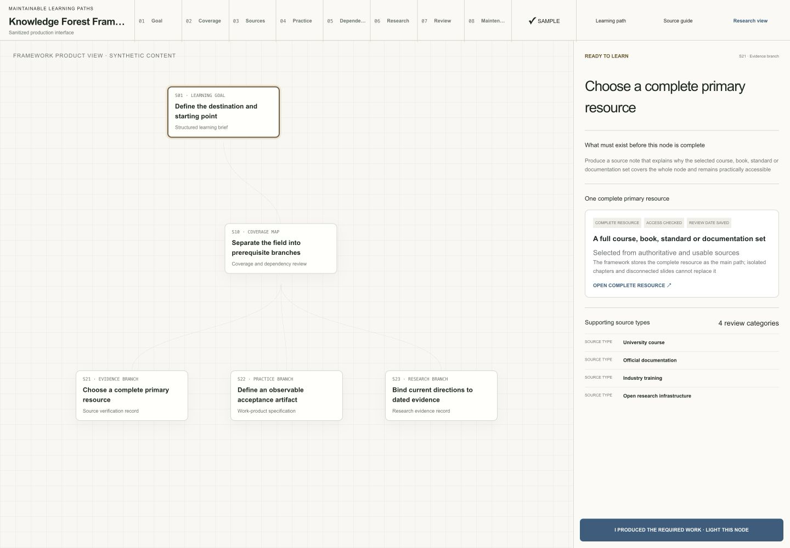
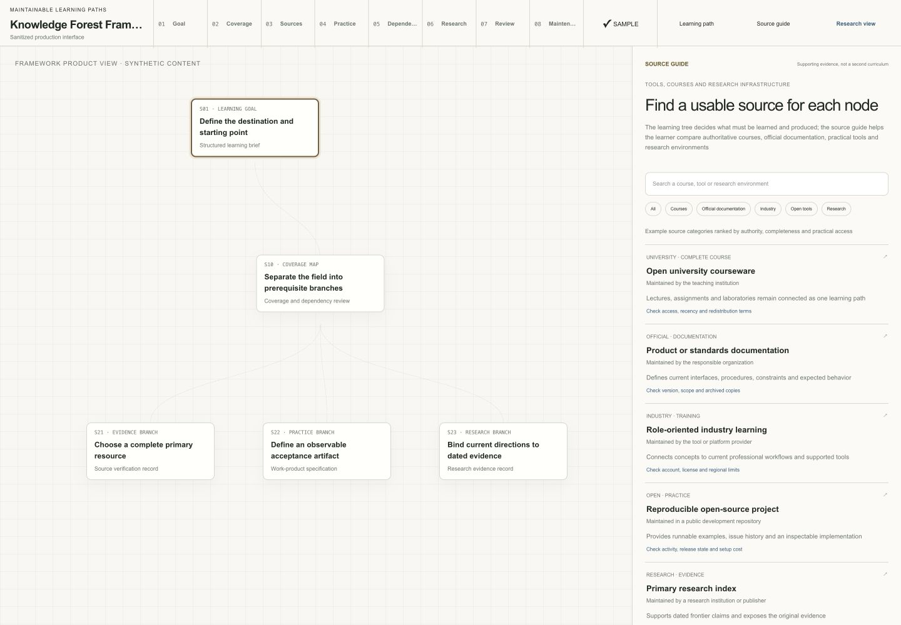
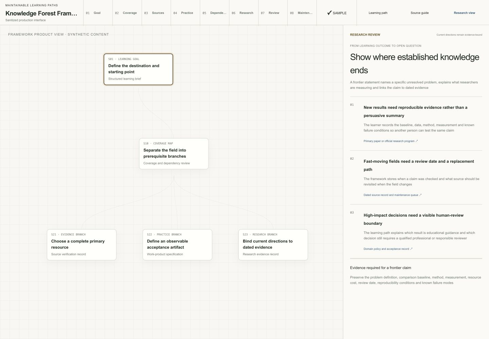
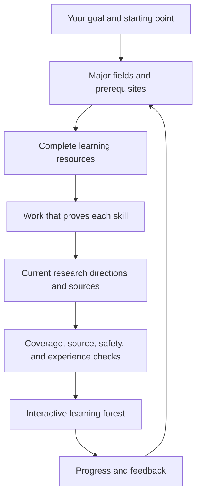

<div align="center">

# Knowledge Forest Framework

**Describe what you want to learn; get a clear path you can follow, finish, and maintain**

[](https://github.com/AIALRA-0/knowledge-forest-framework/actions/workflows/ci.yml)
[](LICENSE)
[](docs/privacy.md)
[](docs/privacy.md)

[English demo](https://aialra-0.github.io/knowledge-forest-framework/?lang=en) · [中文演示](https://aialra-0.github.io/knowledge-forest-framework/?lang=zh-CN) · [中文说明](README.zh-CN.md) · [How it works](docs/architecture.md) · [Quality checks](docs/quality-gates.md) · [Security](SECURITY.md)

</div>

Knowledge Forest turns a broad ambition into separate learning paths; every step tells you what to learn from, what to make before moving on, what must be completed first, and where current research is heading

## Product interface

A broad learning goal contains several kinds of work that should not be hidden inside one long checklist

- the tree shows what can be learned now, what can proceed in parallel, and what must wait
- the node panel keeps the learning outcome, complete primary resource, and required work together
- the source guide compares courses, official documentation, industry training, open tools, and research evidence
- the research view separates established knowledge from current open questions and records how each claim can be checked

The following screens are rendered by the production product interface with synthetic content; they describe framework behavior without reading or exposing any learner's fields, records, resources, or progress

### Learning path and node requirements

The vertical tree exposes prerequisites and parallel branches; the panel defines the work that must exist before the selected node can be marked complete

<p align="center">
  
</p>

### Source guide

The source guide helps a learner compare complete and usable resources after the tree has already defined the learning outcome

<p align="center">
  
</p>

### Research review

The research view names an unresolved problem, the evidence needed to evaluate it, and the boundary that still requires human review

<p align="center">
  
</p>

## What you do

1. Write the goal in your own words; include what you already know, how much time you have, and any limits that matter
2. Give the generated request to an agent using the included workflow
3. Open the resulting forest and choose a field
4. Learn from the complete resource; produce the listed piece of work; mark the step complete; move to the next unlocked step
5. Return later and continue from the progress saved in your browser

## What you see at every step

- one focused skill or idea
- a short explanation of why it matters
- one complete course, book, article, standard, or official documentation set
- a concrete result to produce before the step counts as complete
- prerequisite steps and a clear explanation when the step is locked
- three current research directions with dated sources
- progress, feedback, export, and a way to report an unavailable resource

The public example is a real dependency tree, not a single chain; two shared foundations split into evidence, accessibility, visualization, and reliable-delivery branches, then reunite at publication; it contains twelve steps, twelve complete resources, twelve practical outcomes, and thirty-six current research directions

English and Chinese have separate entry URLs and fully localized interfaces; both render the same dependency graph and preserve the same browser-local progress without mixing languages on one page


## Try it

Open the [English demo](https://aialra-0.github.io/knowledge-forest-framework/?lang=en); the [Chinese demo](https://aialra-0.github.io/knowledge-forest-framework/?lang=zh-CN) is a separate localized entry; enter a goal such as:

```text
I want to build reliable household robots; I already know Python and basic linear algebra
```

The page prepares a structured request; an agent then researches the field, checks the sources, and generates the complete forest

## Run it locally

```bash
git clone https://github.com/AIALRA-0/knowledge-forest-framework.git
cd knowledge-forest-framework
npm install
npm run dev
```

Prepare a request from the command line:

```bash
node packages/cli/bin/knowledge-forest.mjs brief \
  "Build a research-level learning forest for embodied AI; I already know Python"
```

Check a generated forest:

```bash
node packages/cli/bin/knowledge-forest.mjs audit \
  examples/public-demo/forest.generated.json
```

Give [`skills/knowledge-forest/SKILL.md`](skills/knowledge-forest/SKILL.md) to a compatible agent for the complete research and generation workflow

## How a forest is produced



Every production run creates:

```text
forest.generated.json
provenance.json
audit-report.json
review-queue.json
```

In plain language; these files contain the forest shown on the page, where its information came from, which checks passed, and which decisions still need a person

## Quality checks

`npm test` checks that:

- every step belongs to a clear field and has valid prerequisites
- links point to complete resources rather than isolated chapters
- completion requires a visible piece of work
- current research directions have dates and sources
- health, finance, aviation, space, and security requests receive appropriate boundaries
- private paths, accounts, credentials, and personal course records cannot enter the public build
- the production page builds successfully

Automated checks are not enough; releases also include realistic desktop and mobile use; reviewers record where a person became confused, whether recovery was obvious, and what changed afterward

Read the latest [real user journey review](docs/user-journey-review.md)

## Public and private projects

Use this public repository for reusable code, empty templates, synthetic examples, and common improvements

Keep personal progress, private learning data, restricted resources, research archives, credentials, authentication, and deployment configuration in a separate private repository; the framework does not copy private data into the public project

## For maintainers

```text
app/                         interactive public demo
packages/schema/             data shapes shared by generators and renderers
packages/core/               prerequisite, progress, and quality rules
packages/agent/              plain-language request preparation
packages/cli/                local request and validation commands
skills/knowledge-forest/     end-to-end agent workflow
prompts/                     focused research instructions
schemas/                     machine-readable file definitions
templates/                   empty learner inputs
examples/public-demo/        independently public example
docs/                        design, quality, privacy, and policy
scripts/                     reports, statistics, sanitization, and journey checks
tests/                       repeatable release checks
```

The [project landscape](docs/project-landscape.md) compares related curriculum, roadmap, graph, and research-index projects; the [architecture](docs/architecture.md) explains the internal file flow; the [agent protocol](docs/agent-protocol.md) defines the generation process

## Privacy and content rights

- progress and feedback stay in the browser by default
- the public demo includes no telemetry
- public examples are independently generated
- third-party material remains link-only unless redistribution permission is explicit
- original code uses Apache-2.0
- public example learning content uses CC BY 4.0
- generated forests keep the license selected by their owner

Read [privacy](docs/privacy.md), [content policy](docs/content-policy.md), and [security](SECURITY.md) before publishing an instance

## Contributing

Start with [CONTRIBUTING.md](CONTRIBUTING.md); explain the user problem, show the resulting behavior, and include the checks and real journey used to evaluate the change

## Roadmap

- `0.2` connect more research sources and preserve link snapshots
- `0.3` add extension interfaces and richer connections between fields
- `1.0` guarantee long-term file compatibility and signed releases

## Status

This is an early public release; use the review queue when a source, license, safety boundary, or field-coverage decision still needs a person; a generated forest is a learning guide and does not replace professional medical, legal, financial, licensing, or regulatory advice
