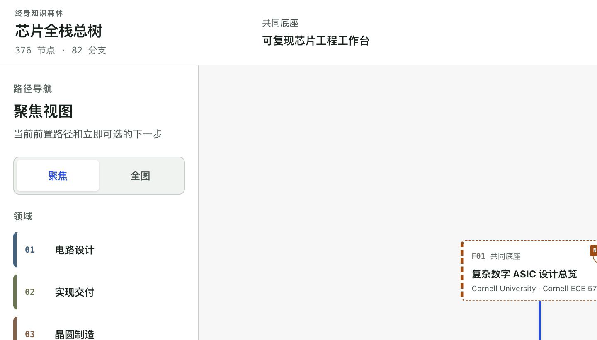
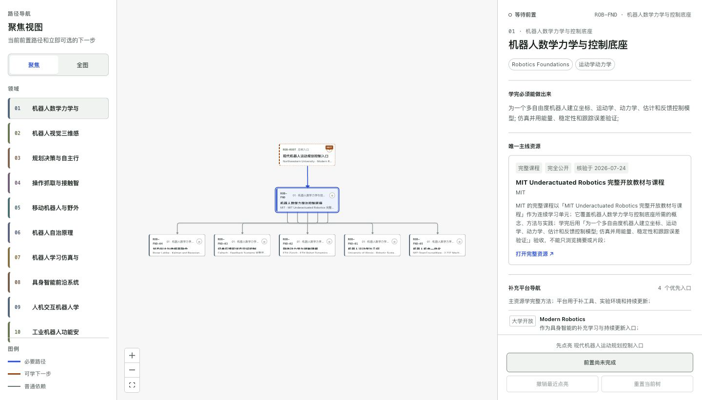
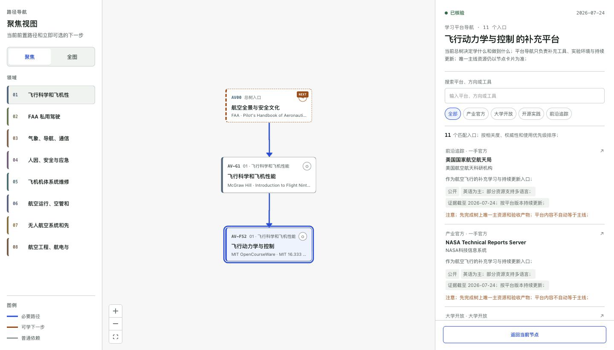
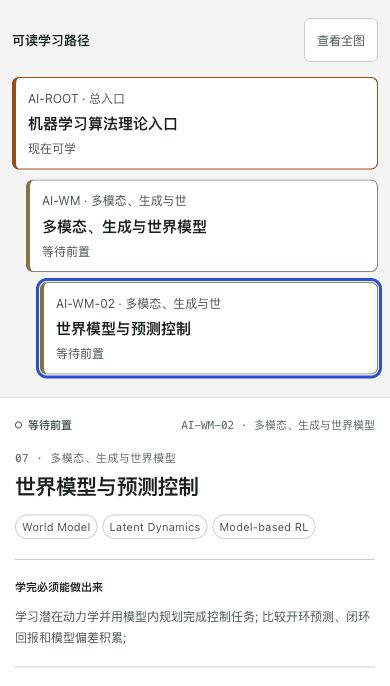
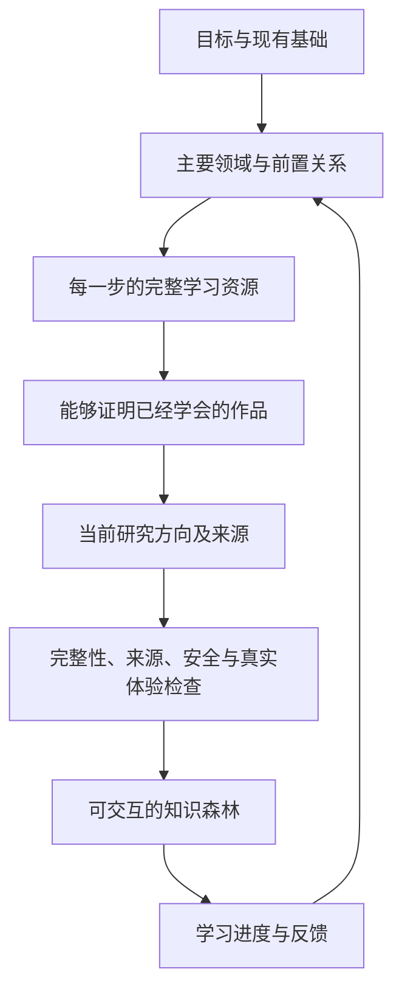

<div align="center">


图 1 项目视觉概览

# 知识森林框架

**说清楚你想学什么；得到一张可以照着学、逐步完成、长期维护的路线图**

[](https://github.com/AIALRA-0/knowledge-forest-framework/actions/workflows/ci.yml)
[](package.json)
[](package.json)
[](LICENSE)
[](docs/privacy.md)
[](docs/privacy.md)

[English](README.en.md) · [演示入口](#6-直接体验) · [工作原理](docs/architecture.md) · [质量检查](docs/quality-gates.md) · [安全](SECURITY.md)

</div>

> [!IMPORTANT]
> README 不公开正式产品地址、访问控制、私有仓库、个人进度、账号、凭据、主机信息或部署配置；公开演示请从仓库首页 Description 区域的 Website 入口进入

## 1 项目定位

Knowledge Forest 会把宽泛目标拆成不同领域的学习路径 [1]

每一步都会说明学习资源、验收作品、前置条件和当前研究方向

## 2 产品界面

公开版本与正式产品使用同一套视觉和交互模型

默认聚焦视图只保留必要前置路径与立即可选的下一步，领域全图用于确认整体结构，日常学习不会被整棵大树淹没

蓝线表示进入当前节点的准确前置路径；棕线表示已经满足条件并可立即学习的下一步；灰线保留周边依赖语境

下面的中文图片直接截取自当前正式产品中的真实领域；截图已经去除会暴露个人进度、私有地址、访问控制、部署信息或私有规模的位置

### 2.1 芯片节点

芯片节点同时保留准确前置路径、可检查的工程作品、完整主线资源与补充平台

<p align="center">
  
  <br>图 2.1 芯片节点、前置路径、学习资源和验收作品 [2]
</p>

### 2.2 机器人分支地图

机器人页面选择数学、力学与控制入口并展开多个可以独立推进的分支

动力学、感知、操作与实时安全分别推进，最后在能够运行的机器人系统中汇合

<p align="center">
  
  <br>图 2.2 机器人领域的分支与汇合结构 [2]
</p>

### 2.3 航空资源目录

航空页面围绕飞行动力学与控制节点打开经过筛选的平台目录

每份资料承担不同的学习任务，不会把课程、法规、工具与研究档案混成一份清单

<p align="center">
  
  <br>图 2.3 航空学习树和权威资源目录 [2]
</p>

### 2.4 人工智能研究复核

AI 页面选择 World Models 分支并打开研究复核

每个方向先说明仍未解决的工程问题，再连接到带日期的公开证据

<p align="center">
  
  <br>图 2.4 世界模型分支和带日期的研究证据 [2]
</p>

### 2.5 移动端可读路径

移动端把二维画布替换为按照依赖深度缩进的可读列表；节点说明、研究证据与验收作品继续保留

手机界面改变排列方式；不删减学习判断所需的信息

<p align="center">
  
  <br>图 2.5 移动端依赖列表、研究证据和验收作品 [2]
</p>

## 3 使用流程

- 第一步，用自己的话写下目标，同时写明已经掌握的内容、可投入时间和重要限制

- 第二步，将页面生成的学习需求交给使用本框架的智能代理

- 第三步，打开生成后的知识森林并选择一个领域

- 第四步，使用节点提供的完整资源学习，完成节点要求的作品，点亮节点并进入下一个已经解锁的节点

- 第五步，下次回来时继续使用浏览器中保存的进度

## 4 节点内容

- 一个明确的技能或问题
- 它为什么值得学习
- 一门完整课程、一本完整教材、一篇完整文章、一个完整标准或一套完整官方文档
- 学完以后必须做出的具体作品
- 前置节点，以及节点被锁定时仍缺少的条件
- 三个当前研究方向及其日期和来源
- 进度、反馈、导出和资源失效报告

## 5 公开示例

公开案例是一棵完整的 RISC-V SoC 技术依赖树，不是一条单线列表

ISA 与可综合 RTL 两个技术底座会分叉进入体系结构、RTL 验证、物理实现和软件集成，最终在可启动的 FPGA SoC 原型重新汇合

公开示例包含 12 个节点，每个节点各有 1 份完整资源和 1 项工程验收产物，因此资源和产物均为 12 项 [3]

每个节点保留 3 个当前研究方向，方向总数为 $12 \times 3 = 36$ [3]

中文与英文使用两个独立入口和完整本地化界面

两个入口显示同一棵依赖树并共享浏览器本地进度，单个页面不会混用两种语言

下图和表格直接读取公开示例的生成数据 [3]

<div align="center">


图 5.1 从公开 ForestBundle 自动生成的演示统计

</div>

<div align="center">

表 5.1 公开示例规模

| 指标 | 数量 | 用途 |
| --- | ---: | --- |
| 领域 | 4 | 表示公开案例覆盖的主要分支 |
| 节点 | 12 | 表示可学习和可验收的步骤 |
| 完整资源 | 12 | 每个节点配置一份主线资源 |
| 研究方向 | 36 | 每个节点保留三个带日期的前沿方向 |
| 质量轮次 | 3 | 分别检查结构、证据和真实体验 |

注：12 个节点 × 每节点 3 个研究方向 = 36 个研究方向

</div>

## 6 直接体验

从仓库首页 Description 区域的 Website 入口打开公开演示，中文与英文使用独立入口

可以输入下面这类目标

> 我想完成 RV32IM SoC 的 RTL 验证、物理实现、固件和 FPGA 原型；我已经掌握数字逻辑

页面会整理出清晰的学习需求，智能代理随后调查完整领域、核验资源并生成最终知识森林

## 7 本地运行

```bash
git clone https://github.com/AIALRA-0/knowledge-forest-framework.git # 克隆公开框架代码
cd knowledge-forest-framework # 进入项目目录
npm install # 按锁文件安装依赖
npm run dev # 启动本地开发界面
```

项目要求 Node.js 22.13 或更新版本 [4]

通过命令行整理学习需求

```bash
node packages/cli/bin/knowledge-forest.mjs brief "构建具身智能研究级学习森林；我已经学过 Python" # 将自然语言目标整理成结构化需求
```

检查生成后的森林

```bash
node packages/cli/bin/knowledge-forest.mjs audit examples/public-demo/forest.generated.json # 校验生成结果
```

将 [`skills/knowledge-forest/SKILL.md`](skills/knowledge-forest/SKILL.md) 交给兼容的智能代理，它会执行完整调查、生成和检查流程

## 8 森林生成

<div align="center">



图 8.1 知识森林的调查、生成、审核和学习闭环

</div>

每次正式生成都会提供以下文件

```text
# 生成产物
forest.generated.json  # 页面呈现的森林
provenance.json        # 信息来源记录
audit-report.json      # 自动检查结果
review-queue.json      # 需要人工决定的事项
```

这些文件分别保存页面要显示的森林、信息来源、检查结果和需要人工决定的事项

## 9 质量门

运行 `npm test` 会执行结构、证据、体验、脱敏和构建检查 [5]

- 每个节点都属于明确领域，前置关系能够正常解锁
- 学习资源是完整课程或完整资料，不是随意截取的一章
- 学完必须产生可查看的作品
- 当前研究方向带有日期和来源
- 健康、金融、航空、航天和安全等领域具有适当边界
- 私有路径、账号、凭据和个人课程记录不能进入公共版本
- 最终页面能够正常构建

自动检查是第一层，每次发布还要用桌面端和移动端完成真实任务

旅程报告记录用户在哪里困惑、能否找到恢复办法、最后具体修改了什么

可以查看最新的[真实用户旅程报告](docs/user-journey-review.md)

## 10 公私仓库边界

公共仓库保存可复用代码、空白模板、合成示例和通用改进

个人学习数据、进度、受限资源、研究档案、凭据、认证和部署配置放在独立私有仓库

本框架不会把私有数据复制到公共项目

## 11 维护者入口

<div align="center">

表 11.1 维护者目录导航

| 路径 | 内容 |
| --- | --- |
| `app/` | 公开交互演示 |
| `packages/schema/` | 生成器与页面共同使用的数据形状 |
| `packages/core/` | 前置关系、进度与质量规则 |
| `packages/agent/` | 将自然语言目标整理成清晰需求 |
| `packages/cli/` | 本地生成与检查命令 |
| `skills/knowledge-forest/` | 智能代理完整工作流程 |
| `prompts/` | 针对不同调查阶段的提示 |
| `schemas/` | 机器可读取的文件定义 |
| `templates/` | 空白用户输入 |
| `examples/public-demo/` | 独立生成的公开示例 |
| `docs/` | 设计、质量、隐私和政策 |
| `scripts/` | 报告、统计、脱敏和体验检查 |
| `tests/` | 可重复执行的发布检查 |

</div>

阅读[相关项目调查](docs/project-landscape.md)可以了解现有项目与本框架的边界

阅读[系统结构](docs/architecture.md)可以了解文件如何流动，阅读[智能代理工作协议](docs/agent-protocol.md)可以了解生成流程

## 12 隐私边界

- 进度和反馈默认只保存在浏览器 [6]
- 公开演示不包含行为追踪
- 公开示例独立生成
- 没有明确再分发许可的第三方资料只保留链接 [7]
- 原创代码采用 Apache-2.0
- 公开示例学习内容采用 CC BY 4.0
- 用户生成的森林由用户自己选择许可证

发布实例前请阅读[隐私边界](docs/privacy.md)、[内容政策](docs/content-policy.md)和[安全政策](SECURITY.md) [8]

## 13 贡献指南

从 [CONTRIBUTING.md](CONTRIBUTING.md) 开始

贡献说明需要包含用户遇到的问题、修改后的实际行为、自动检查和真实旅程

## 14 路线图

- `0.2` 连接更多研究来源并保留链接快照 [9]
- `0.3` 增加扩展接口和更丰富的跨领域连接 [9]
- `1.0` 保证长期文件兼容性并提供签名发布 [9]

## 15 当前状态

项目仍处于早期公共版本

当来源、许可证、安全边界或领域完整性仍需人工判断时，相关事项保留待复核状态

生成的森林是学习指导，不能替代医疗、法律、金融、执照或监管领域的专业意见

## 16 参考资料

[1] AIALRA-0, “Architecture,” `docs/architecture.md`, Knowledge Forest Framework repository

[2] AIALRA-0, “Public-safe product gallery,” `docs/images/gallery.json`, Knowledge Forest Framework repository

[3] AIALRA-0, “Generated public demo and statistics,” `examples/public-demo/forest.generated.json` and `public/readme-stats.svg`, Knowledge Forest Framework repository

[4] AIALRA-0, “Runtime and release scripts,” `package.json`, Knowledge Forest Framework repository

[5] AIALRA-0, “Quality gates,” `docs/quality-gates.md`, Knowledge Forest Framework repository

[6] AIALRA-0, “Privacy boundary,” `docs/privacy.md`, Knowledge Forest Framework repository

[7] AIALRA-0, “Content policy and licensing,” `docs/content-policy.md`, `LICENSE`, and `LICENSE-CONTENT.md`, Knowledge Forest Framework repository

[8] AIALRA-0, “Security policy,” `SECURITY.md`, Knowledge Forest Framework repository

[9] AIALRA-0, “Published roadmap,” `README.en.md`, Knowledge Forest Framework repository
