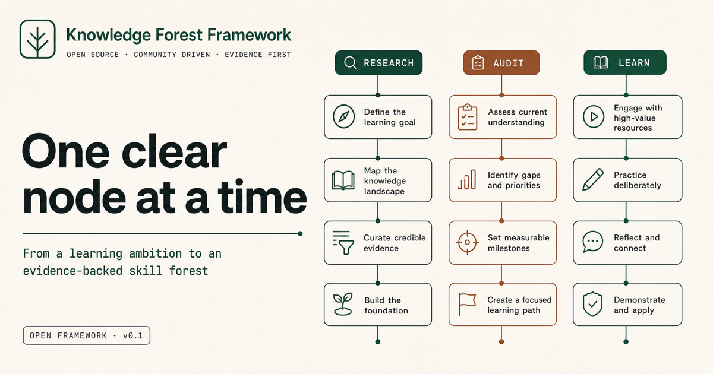
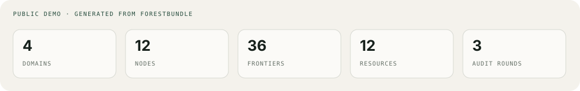

<div align="center">



# 知识森林框架

**把一句学习目标转化为有证据、可验收、可长期维护的技能森林**

[在线演示](https://aialra-0.github.io/knowledge-forest-framework/) · [English](README.md) · [Agent 协议](docs/agent-protocol.md) · [质量门](docs/quality-gates.md) · [安全](SECURITY.md)

</div>

Knowledge Forest 是一个面向 Agent 的开源框架；Agent 负责调查领域、拆分方向、验证完整资源、设计验收产物、绑定当前前沿证据，并生成可以逐节点点亮的纵向学习树；

它不是一次性课程生成器；



## 默认不会再犯的六类错误

1. 所有树从上到下展开；
2. 先分领域，再生成节点；禁止从一个根节点长出所有内容；
3. 每个节点只选完整课程、完整教材、完整文章、完整标准或完整官方文档；
4. 复合主题优先拆成独立节点；
5. 每个节点必须有三条当前前沿及可追溯证据；
6. 发布前必须执行真实用户旅程；不能只靠机械测试判断体验；

用户提出的后续更正会写入 `brief.json`；每条更正都必须带稳定标识和回归检查；用户不需要重复已经接受的要求；

## 快速开始

```bash
git clone https://github.com/AIALRA-0/knowledge-forest-framework.git
cd knowledge-forest-framework
npm install
npm run dev
```

生成 Agent 可读需求合同；

```bash
node packages/cli/bin/knowledge-forest.mjs brief \
  "构建具身智能研究级学习森林；我已经学过 Python"
```

验证最终森林；

```bash
node packages/cli/bin/knowledge-forest.mjs audit \
  examples/public-demo/forest.generated.json
```

让 Agent 遵循 [`skills/knowledge-forest/SKILL.md`](skills/knowledge-forest/SKILL.md)；它会完成分类体系调查、资源核验、前沿证据、三轮审计、人工复核队列和真实体验评价；

## 固定输出

```text
forest.generated.json
provenance.json
audit-report.json
review-queue.json
```

交互网站只读取通过审计的 `forest.generated.json`；

## 公开与私有的长期边界

```text
public framework release
          │
          │ 固定精确版本
          ▼
private learner instance
```

真实知识数据、个人进度、受限资源、研究档案、认证和生产配置留在私有实例；通用改进使用合成案例在 public 重新实现；不存在 private 自动同步到 public 的路径；

## 质量标准

```bash
npm test
```

自动门禁覆盖结构、依赖、完整资源、验收产物、三条前沿、证据日期、高风险识别、进度状态、脱敏和生产构建；自动门通过后仍必须完成真实桌面与移动端旅程，并记录哪里困惑、如何恢复、最终改了什么；

## 许可

- 原创代码采用 Apache-2.0；
- 公开示例学习内容采用 CC BY 4.0；
- 第三方课程默认只保留链接、书目信息、许可证与原创说明；
- 用户生成森林的许可证由用户自己决定；

发布实例前请阅读 [隐私边界](docs/privacy.md)、[内容政策](docs/content-policy.md) 和 [安全政策](SECURITY.md)；
