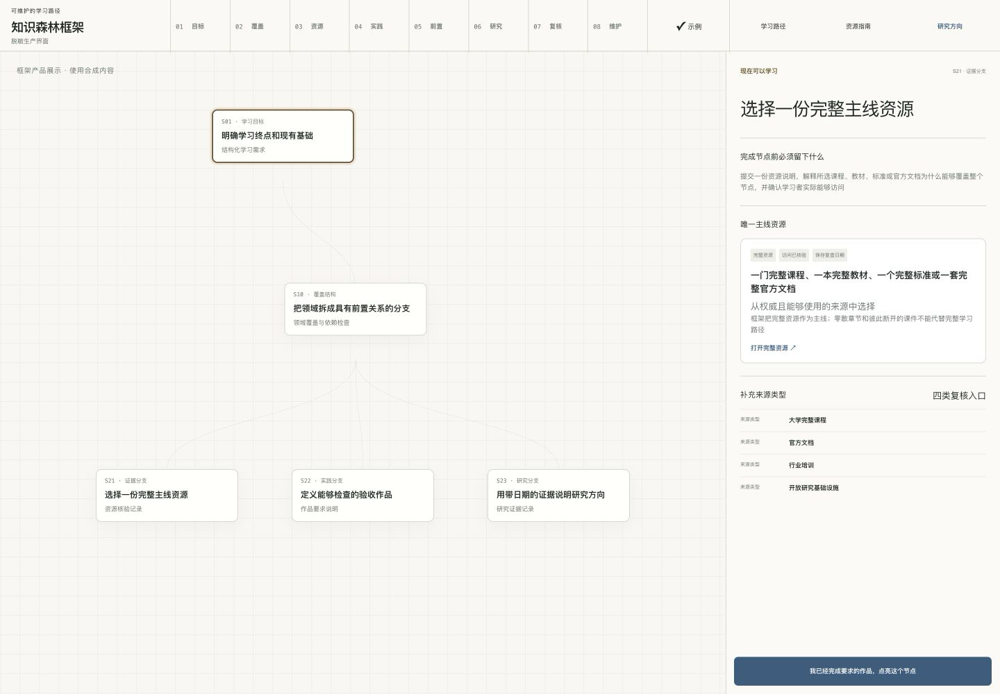
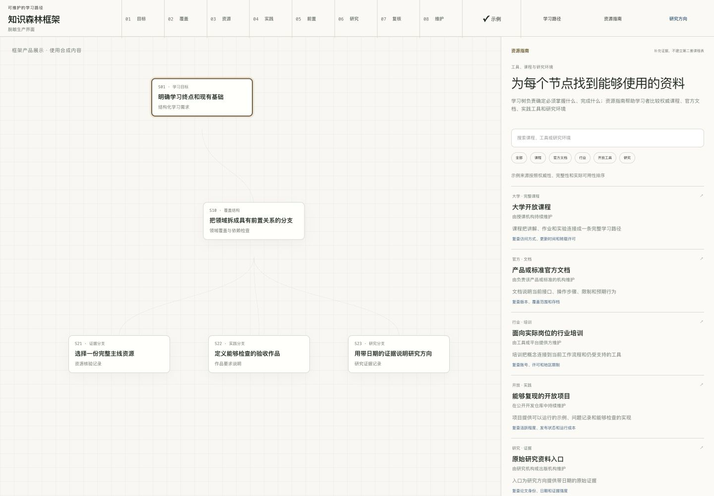
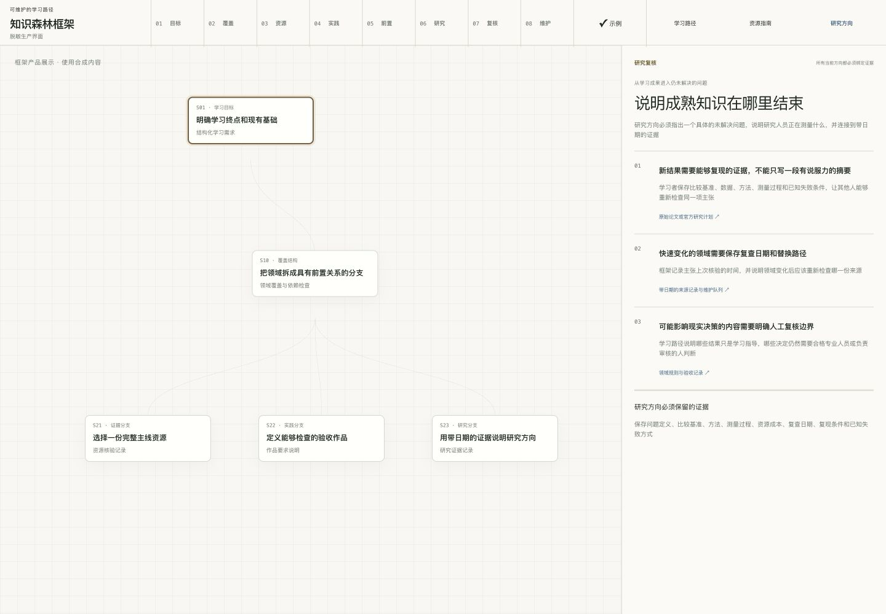
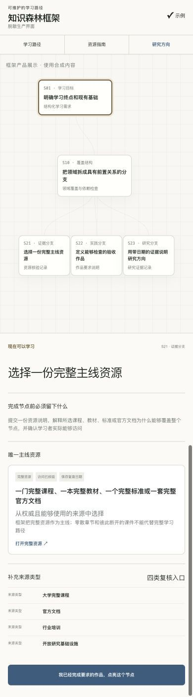
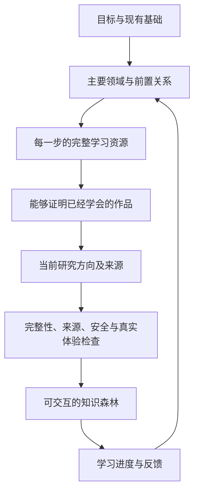

<div align="center">

# 知识森林框架

**说清楚你想学什么；得到一张可以照着学、逐步完成、长期维护的路线图**

[中文演示](https://aialra-0.github.io/knowledge-forest-framework/?lang=zh-CN) · [English demo](https://aialra-0.github.io/knowledge-forest-framework/?lang=en) · [English](README.md) · [工作原理](docs/architecture.md) · [质量检查](docs/quality-gates.md) · [安全](SECURITY.md)

</div>

Knowledge Forest 会把宽泛目标拆成不同领域的学习路径；每一步都会告诉你去哪里学、学完要做出什么、必须先完成什么，以及这个方向目前正在研究什么；

## 产品界面

宽泛的学习目标通常同时包含前置知识、并行分支、学习资源、实践作品和研究方向，全部挤进一份清单会让学习者无法判断下一步

框架把这些信息分到四个能够直接执行的界面：

- 学习树显示现在可以学习什么、哪些分支可以并行推进、哪些节点仍在等待前置成果
- 节点面板把学习目标、完整主线资源和验收作品放在同一处
- 资源指南帮助学习者比较完整课程、官方文档、行业培训、开放工具和研究资料
- 研究复核界面区分成熟知识与未解决问题，并说明每项主张需要什么证据

这些图片由正式产品界面使用合成内容渲染，只说明框架如何工作，不读取或展示任何使用者的学习领域、记录、资源和进度

### 学习路径

竖向分支树显示前置关系和并行路径，右侧面板说明完成当前节点前必须留下什么作品

<p align="center">
  
</p>

### 资源指南

学习树确定学习目标后，资源指南再帮助学习者比较完整且能够使用的资料，不会另外建立一套互相冲突的课程表

<p align="center">
  
</p>

### 研究复核

研究复核界面指出仍未解决的问题、判断进展所需的证据，以及必须交给专业人员或负责人判断的边界

<p align="center">
  
</p>

### 移动端完整页面

移动端保留相同的分支关系、节点说明、完整资源、补充来源和点亮操作，学习者不需要在手机上使用删减版功能

<p align="center">
  
</p>

## 你需要做什么

1. 用自己的话写下目标；同时写明已经掌握的内容、可投入时间和重要限制；
2. 将页面生成的学习需求交给使用本框架的 Agent；
3. 打开生成后的知识森林并选择一个领域；
4. 使用节点提供的完整资源学习；完成节点要求的作品；点亮节点；进入下一个已经解锁的节点；
5. 下次回来时继续使用浏览器中保存的进度；

## 每个节点会提供什么

- 一个明确的技能或问题；
- 它为什么值得学习；
- 一门完整课程、一本完整教材、一篇完整文章、一个完整标准或一套完整官方文档；
- 学完以后必须做出的具体作品；
- 前置节点；节点被锁定时会直接说明还缺什么；
- 三个当前研究方向及其日期和来源；
- 进度、反馈、导出和资源失效报告；

公开案例是一棵真实依赖树；不是一条单线列表；两个共同底座会分叉进入证据理解、无障碍交互、视觉表达和可靠交付四个领域；最终在发布节点重新汇合；它包含十二个节点、十二份完整资源、十二项实践作品和三十六个当前研究方向；

中文与英文使用两个独立入口和完整本地化界面；二者显示同一棵依赖树并共享浏览器本地进度；单个页面不会混用两种语言；


## 直接体验

打开[中文演示](https://aialra-0.github.io/knowledge-forest-framework/?lang=zh-CN)；[英文演示](https://aialra-0.github.io/knowledge-forest-framework/?lang=en)使用独立入口；输入类似下面的目标；

```text
我想学习如何构建可靠的家用机器人；我已经掌握 Python 和基础线性代数
```

页面会整理出清晰的学习需求；Agent 随后调查完整领域、核验资源并生成最终知识森林；

## 本地运行

```bash
git clone https://github.com/AIALRA-0/knowledge-forest-framework.git
cd knowledge-forest-framework
npm install
npm run dev
```

通过命令行整理学习需求；

```bash
node packages/cli/bin/knowledge-forest.mjs brief \
  "构建具身智能研究级学习森林；我已经学过 Python"
```

检查生成后的森林；

```bash
node packages/cli/bin/knowledge-forest.mjs audit \
  examples/public-demo/forest.generated.json
```

将 [`skills/knowledge-forest/SKILL.md`](skills/knowledge-forest/SKILL.md) 交给兼容的 Agent；它会执行完整调查、生成和检查流程；

## 森林如何生成



每次正式生成都会提供；

```text
forest.generated.json
provenance.json
audit-report.json
review-queue.json
```

简单来说；这些文件分别保存页面要显示的森林、信息来自哪里、哪些检查已经通过、哪些判断仍然需要人来决定；

## 质量检查

运行 `npm test` 会检查；

- 每个节点都属于明确领域；前置关系能够正常解锁；
- 学习资源是完整课程或完整资料；不是随意截取的一章；
- 学完必须产生可查看的作品；
- 当前研究方向带有日期和来源；
- 健康、金融、航空、航天和安全等领域具有适当边界；
- 私有路径、账号、凭据和个人课程记录不能进入公共版本；
- 最终页面能够正常构建；

自动检查只是第一层；每次发布还要用桌面端和移动端完成真实任务；记录用户在哪里困惑、能否找到恢复办法、最后具体修改了什么；

可以查看最新的[真实用户旅程报告](docs/user-journey-review.md)；

## 公共项目与私有项目

公共仓库保存可复用代码、空白模板、合成示例和通用改进；

个人学习数据、进度、受限资源、研究档案、凭据、认证和部署配置放在独立私有仓库；本框架不会把私有数据复制到公共项目；

## 维护者入口

```text
app/                         公开交互演示
packages/schema/             生成器与页面共同使用的数据形状
packages/core/               前置关系、进度与质量规则
packages/agent/              将自然语言目标整理成清晰需求
packages/cli/                本地生成与检查命令
skills/knowledge-forest/     Agent 完整工作流程
prompts/                     针对不同调查阶段的提示
schemas/                     机器可读取的文件定义
templates/                   空白用户输入
examples/public-demo/        独立生成的公开示例
docs/                        设计、质量、隐私和政策
scripts/                     报告、统计、脱敏和体验检查
tests/                       可重复执行的发布检查
```

阅读[相关项目调查](docs/project-landscape.md)可以了解现有项目与本框架的边界；阅读[系统结构](docs/architecture.md)可以了解文件如何流动；阅读[Agent 工作协议](docs/agent-protocol.md)可以了解生成流程；

## 隐私与内容许可

- 进度和反馈默认只保存在浏览器；
- 公开演示不包含行为追踪；
- 公开示例独立生成；
- 没有明确再分发许可的第三方资料只保留链接；
- 原创代码采用 Apache-2.0；
- 公开示例学习内容采用 CC BY 4.0；
- 用户生成的森林由用户自己选择许可证；

发布实例前请阅读[隐私边界](docs/privacy.md)、[内容政策](docs/content-policy.md)和[安全政策](SECURITY.md)；

## 参与贡献

从 [CONTRIBUTING.md](CONTRIBUTING.md) 开始；说明用户遇到了什么问题、修改后实际会发生什么、使用了哪些自动检查和真实旅程；

## 当前状态

项目仍处于早期公共版本；当来源、许可证、安全边界或领域完整性仍需人工判断时保留待复核状态；生成的森林是学习指导；不能替代医疗、法律、金融、执照或监管领域的专业意见；
